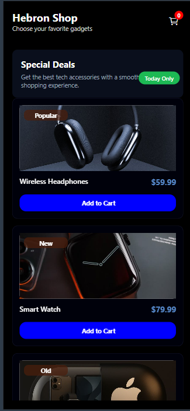
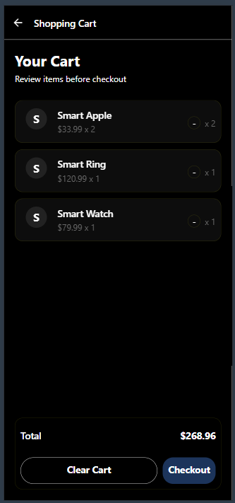

#  Hebron Shop React Native (Expo)

A modern mobile shopping app built with React Native and Expo. Features a product listing screen, a cart managed via React Context API, and smooth stack navigation between screens.

---

## Screenshots
## Home Screen

## Cart Screen


---

## Features

- Browse gadgets with product cards (name, price, category badge)
- Add items to cart with quantity tracking
- Cart badge showing total item count in real time
- Cart screen with item breakdown, quantity control, and total price
- Clear cart or remove items one by one
- State managed globally with React Context API
- Stack navigation with back button (React Navigation)

---

## Project Structure

```
├── App.js                        # Root component — Context provider + Navigation setup
├── context/
│   └── CartContext.jsx           # Cart context (createContext + default values)
├── screens/
│   ├── HomeScreen/
│   │   └── index.js              # Product listing screen
│   └── DetailsScreen/
│       └── App.js                # Cart / checkout screen
└── components/
    └── Card.jsx                  # ProductCard component
```

> Note: rename files to match this structure before pushing to GitHub (see note below).

---

## Getting Started

### Prerequisites

- [Node.js](https://nodejs.org/) (v18 or higher)
- [Expo CLI](https://docs.expo.dev/get-started/installation/)
- Expo Go app on your phone, or an Android/iOS emulator

### Installation

1. **Clone the repository**

   ```bash
   git clone https://github.com/your-username/hebron-shop.git
   cd hebron-shop
   ```

2. **Install dependencies**

   ```bash
   npm install
   ```

3. **Install required packages** (if not already in package.json)

   ```bash
   npx expo install @react-navigation/native @react-navigation/native-stack
   npx expo install react-native-screens react-native-safe-area-context
   npx expo install @expo/vector-icons
   ```

4. **Start the app**

   ```bash
   npx expo start
   ```

   Then scan the QR code with Expo Go, or press `a` for Android emulator / `i` for iOS simulator.

---

##  How It Works

### Context (`CartContext.jsx`)
Defines the shape of the cart context with default values — `cartItems`, `addToCart`, `removeFromCart`, `clearCart`, `cartCount`, and `totalPrice`.

### App.js (Root)
Wraps the entire app in `CartContext.Provider` and sets up the stack navigator with two screens: `Home` and `Cart`. Manages all cart logic here using `useState` — adding, removing, and clearing items.

### Home Screen (`screens/HomeScreen/index.js`)
Reads `cartItems` and `addToCart` from context. Renders a header with a live cart badge, a "Special Deals" banner, and a scrollable product list using `ProductCard`.

### Cart Screen (`screens/DetailsScreen/App.js`)
Reads `cartItems`, `totalPrice`, `clearCart`, and `removeFromCart` from context. Shows each item with its quantity and subtotal. Footer displays total price with Clear Cart and Checkout buttons.

### ProductCard (`components/Card.jsx`)
Reusable card component that receives a `product` object and an `onAddToCart` callback. Displays image, name, price, and a category badge (Popular / New / Old).

---

##  Dependencies

| Package | Purpose |
|---|---|
| `react-native` | Core mobile framework |
| `expo` | Development toolchain |
| `@react-navigation/native` | Navigation container |
| `@react-navigation/native-stack` | Stack navigator |
| `@expo/vector-icons` | Ionicons for cart icon |

---

##  Notes

- The uploaded files have mixed names (`App.js` used for `DetailsScreen`, `Card.jsx` used for `App.js`). Rename them to match the structure above before pushing.
- Product data is hardcoded in `HomeScreen` — can be moved to a separate `data/products.js` file for cleaner code.
- `totalPrice` is not rounded — consider using `.toFixed(2)` when displaying it in the cart screen.

---

## Author

**Maysam Bradiya**  
Junior Frontend & Mobile Developer  
[GitHub](https://github.com/MaysamMB) · [LinkedIn](https://www.linkedin.com/in/maysam-baradiya-589757347/)

---

##  License

This project is open source and available under the [MIT License](LICENSE).
